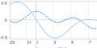

# CHAP Links Library

CHAP Links Library is a web based visualization library for displaying graphs, 
networks, and timelines. 
The tools are developed as 
[Google Visualization Charts](https://developers.google.com/chart/interactive/docs/gallery) 
for Javascript and GWT. 
CHAP Links Library is developed by [Almende](http://almende.com) as part of 
[CHAP](http://chap.almende.com), the Common Hybrid Agent Platform.

The library contains the following components:

<table width="100%">
  <tr>
    <th>
      <a href="graph.html">
        Graph 
        
      </a>
    </th>
    <th>
      <a href="graph3d.html">
        Graph3d 
        
      </a>
    </th>
    <th>
      <a href="network.html">
        Network 
        
      </a>
    </th>
    <th>
      <a href="timeline.html">
        Timeline 
        
      </a>
    </th>
    <th>
      <a href="treegrid.html">
        TreeGrid 
        
      </a>
    </th>
  </tr>
</table>

This site contains documentation, downloads and live examples of the CHAP Links Library.
The Google Group [CHAP Links Library](https://groups.google.com/d/forum/chap-links-library)
can be used to ask questions and share ideas.
Sourcecode can be found at the Github project 
[chap-links-library](https://github.com/almende/chap-links-library).
Issues and feature requests can be submitted via the Github project too.

 

